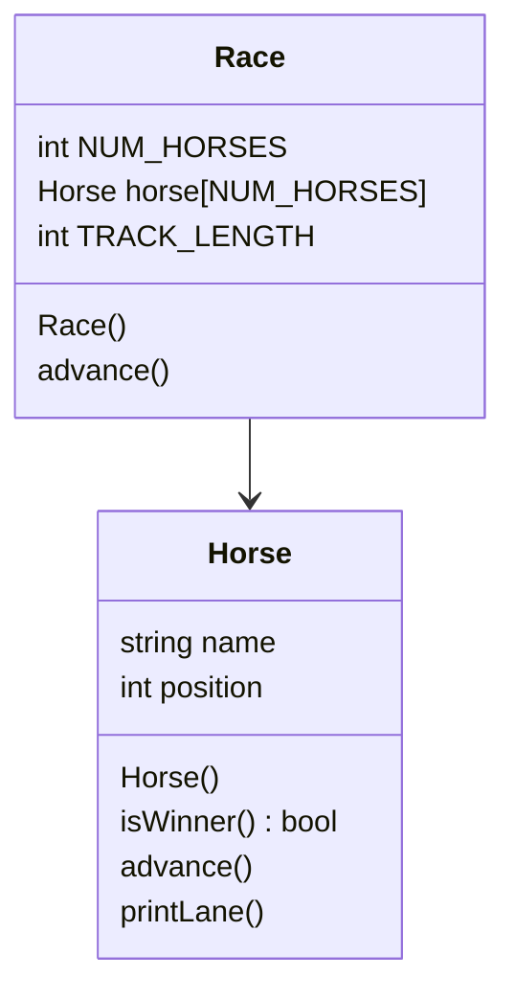

# project5
OOP Horse Race

```mermaid
classDiagram

class Horse {
    string name
    int position
    Horse()
    isWinner() bool
    advance()
    printLane()
}
class Race {
    int NUM_HORSES
    Horse horse[NUM_HORSES]
    int TRACK_LENGTH
    Race()
    advance()
}


Race --> Horse
```
