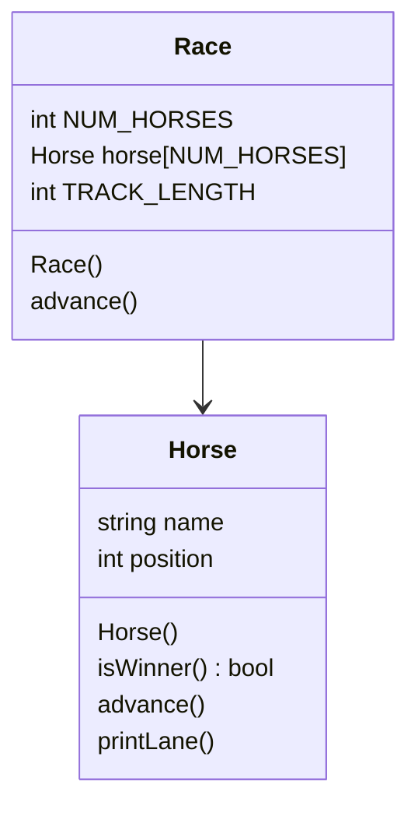

# project5
OOP Horse Race

## UML Diagram

## Algorithm
### Horse
- Horse Constructor
```

```
- advance (int horseNum, int* horse_positon)
```
generate random num 1-2
if 1:
  nada
if 2:
  value of horse_position @ *int horseNum* = +1

```

- printLane (int horseNum, int* horse_position)
```
for numbers 0->*horse_position*:
    print "*"
print *horseNum*
for numbers *horse_position* < 14:
    print "*"
```

- isWinner (int horseNum, int* horse_position)
```
if (value of *horse_position* @ *horseNum* == 14):
  return True
else:
  return False
```
### Race
in header
```
set constant NUM_HORSES to 5
set constant TRACK_LENGTH to 15

```
in constructor
```

```
