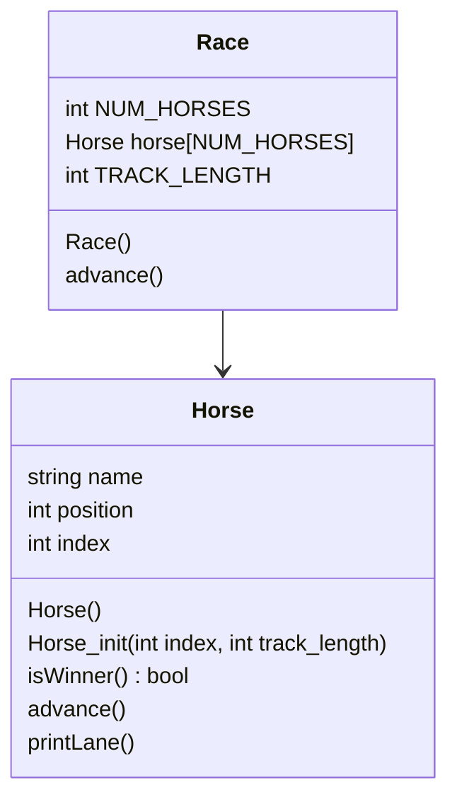

# project5
OOP Horse Race

## UML Diagram

## Algorithm
### Horse
- in constructor
```
set position 0
track_length 15
```

- init (int index, int track_length)
```
my index = index
my track_length = track_length
my position = 0
```

- advance
```
generate random num 0-1
add num to position
```

- printLane ()
```
for numbers 0->*horse_position*:
    print "*"
print *horseNum*
for numbers *horse_position* < 14:
    print "*"
```

- isWinner ()
```
if (value of *horse_position* @ *horseNum* == 14):
  return True
else:
  return False
```
### Race
in header
```
set constant NUM_HORSES to 5
set constant TRACK_LENGTH to 15
```
in constructor
```
go through each horse
initialize horse
```

- Race.start()
```
keepGoing is true
while:
    for every horse:
        advance
        printLane
        if win:
            stop
```


